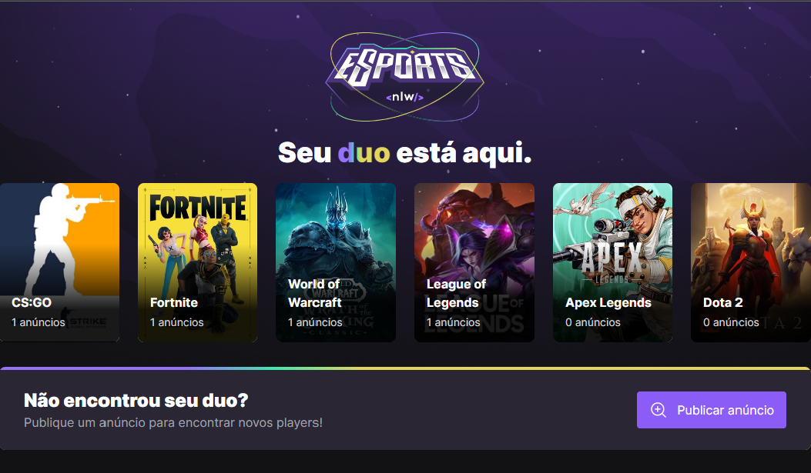

<p align="center">
  
</p>
<h1 align="center">
    
</h1>

<br>

## 🛠 Tecnologias
Foi desenvolvido com:

- [React](https://reactjs.org)
- [Tailwind](https://tailwindcss.com/)
- [Radix](https://www.radix-ui.com/)
- [TypeScript](https://www.typescriptlang.org/)

## 💻 Projeto
Esse foi um projeto desenvolvido na edição eSports da NLW da Rocketseat, para jogadores de games.

## 🚀 Bora executar?
Clone o projeto e acesse a pasta do mesmo.

### No Git Bash dê os comandos:
$ git clone https://github.com/carlosdaniel31/nlw-eSposts-web<br>
$ git clone https://github.com/carlosdaniel31/nlw-eSposts-API

### Para iniciá-lo, siga os passos abaixo:
Em seu editor na pasta nlw-eSports-API dê os comandos:<br>
```npm install```<br>
```npm run dev```

Na pasta nlw-eSports-web dê os comandos:<br>
```npm install```<br>
```npm run dev```
